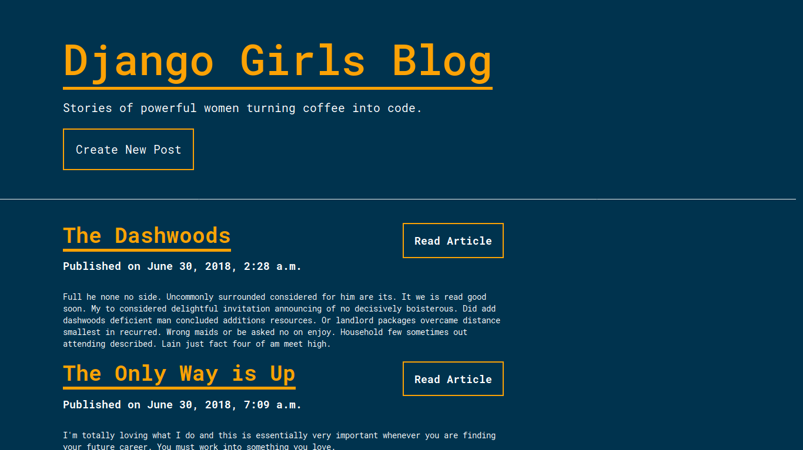

# [30 June 2018] Django Girls CDO Workshop

Here's the preview of what I made during the workshop. We created a simple blog utilizing the Django MVC framework. Here it is:

Homepage preview:


Blog details preview:


New blog post preview:


Edit blog post preview


# Usage
```sh
$ git clone git@github.com:marcreyesph/djangocdo-workshop.git
$ cd djangocdo-workshop
$ pip3 install -r requirements.txt
$ python3 manage.py migrate
$ python3 manage.py collectstatic
$ python3 manage.py runserver
```

Big thanks to [Django Girls CDO](https://djangogirls.org/cagayandeoro/) for this wonderful opportunity.